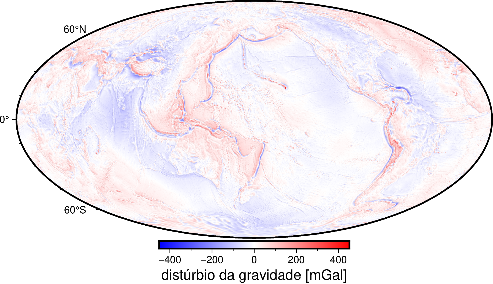
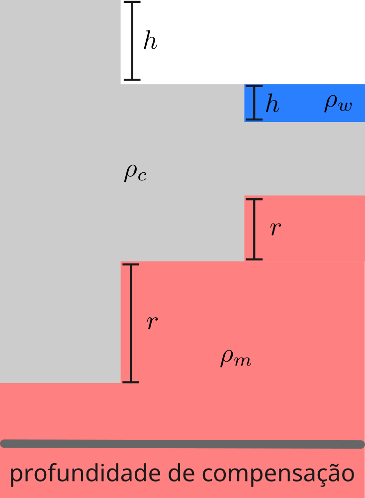
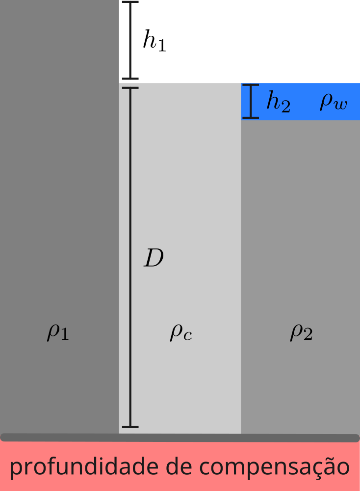
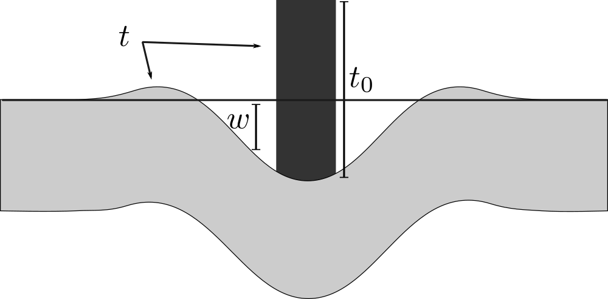
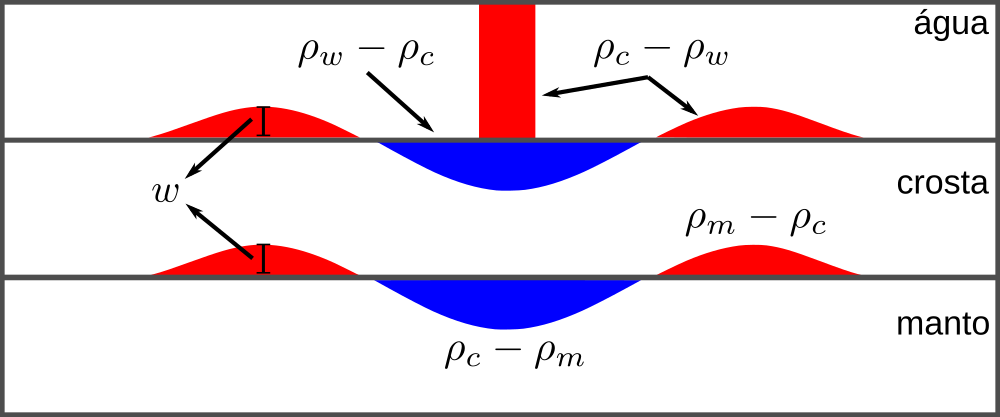

<!--
-------------------------------------------------------------------------------
This file defines the contents of each slide.
The reveal.js configuration can be found in index.html
-------------------------------------------------------------------------------
-->

<!-- .slide: class="slide-title" data-background-image="../assets/title-slide.svg" data-background-color="#000000" data-background-size="contain" -->

<!-- Place the content at the bottom of the slide -->

<h1 id="talk-title">
  Isostasia, flexura e gravidade
</h1>

  <a href="https://www.leouieda.com" id="talk-speaker">Leonardo Uieda</a>

<!-- Place location and date side-by-side with affiliation logos -->

<!-- Permission to reuse and CC-BY license logo -->
<i class="fa fa-camera" style="margin: 0 10px 0 0"></i>
Feel free to screenshot/share/reuse this presentation

<a href="https://creativecommons.org/licenses/by/4.0/"><i class="fab fa-creative-commons"></i><i class="fab fa-creative-commons-by" style="margin: 0 10px 0 2px"></i>CC-BY 4.0 License</a>

<!-- Add logos here. Need these wrappers to align them to the bottom right -->

  

===============================================================================

# Distúrbio da gravidade $\delta g$

* <!-- .element: class="fragment" --> Geralmente menor que +- 50 mGal
* <!-- .element: class="fragment" --> Maiores valores associados a ilhas e subducção
* <!-- .element: class="fragment" --> Indica que a maioria da Terra está em <strong>equilíbrio isostático</strong>
* <!-- .element: class="fragment" --> Por quê?

===============================================================================

# Equilíbrio isostático

* <!-- .element: class="fragment" --> Pressão litoestática na <strong>profundidade de compensação</strong> deve ser constante
* <!-- .element: class="fragment" --> <strong>Modelo de Airy:</strong> topografia/batimetria compensadas por uma raiz/anti-raiz
* <!-- .element: class="fragment" --> Determinar a raiz $r$ a partir da topografia $h$

$ r = \dfrac{\rho_c}{\rho_m - \rho_c} h \qquad $ (continentes)

$ r = \dfrac{\rho_c - \rho_w}{\rho_m - \rho_c} h \qquad  $ (oceanos)

===============================================================================

# Equilíbrio isostático

* <strong>Modelo de Pratt:</strong> topografia/batimetria compensadas por mudanças na densidade
* <!-- .element: class="fragment" --> Determinar a densidade $\rho$ a partir da topografia $h$

$ \rho_1 = \rho_c \dfrac{D}{h_1 + D} \qquad $ (continentes)

$ \rho_2 = \dfrac{\rho_c D - \rho_w h_2}{D - h_2}  \qquad  $ (oceanos)

**🧘 Tarefa:** Deduza as equações acima aplicando os mesmos princípios
utilizados para o modelo de Airy.

===============================================================================

# Distúrbio da gravidade no modelo Airy

Efeitos presentes no distúrbio:
 
topografia $h$, raiz $r$ e heterogeneidades (ignoradas)

Utilizando a equação do platô de Bouguer ($g \approx 2 \pi G \rho h$):

$$
g_h = 2 \pi G \rho_c h
$$

$$
g_r = 2 \pi G (\rho_c - \rho_m) r = - 2 \pi G \rho_c h
$$

**Efeitos da raiz e topografia se anulam**

**🧘 Tarefa:** Mostre que o mesmo se aplica aos oceanos e ao modelo de Pratt

===============================================================================

# Anomalia Bouguer no modelo Airy

Efeito da topografia foi removido

Sobra somente a raiz

$$
\delta g_{bg} = - 2 \pi G \rho_c h
$$

**A anomalia Bouguer tem uma relação linear com a topografia**

Gráficos de anomalia Bouguer X topografia relevam equilíbrio isostático

**🧘 Tarefa:** Mostre que o mesmo se aplica aos oceanos e ao modelo de Pratt

===============================================================================

# Flexura e ilhas oceânicas

* <!-- .element: class="fragment" --> Distúrbio grande  (> 100 mGal)
* <!-- .element: class="fragment" --> Não compensadas por Airy ou Pratt
* <!-- .element: class="fragment" --> <strong>Como as ilhas são sustentadas?</strong>
* <!-- .element: class="fragment" --> Pela rigidez da placa oceânica

===============================================================================

# Flexura da placa oceânica

===============================================================================

# Equação da flexura

$$
D \left( \dfrac{\partial^4}{\partial x^4} + 2\dfrac{\partial^4}{\partial x^2 \partial y^2} + \dfrac{\partial^4}{\partial y^4} \right)
w + g (\rho_m - \rho_w) w = -g(\rho_c - \rho_w) t_0
$$

A carga $t_0$ é a diferença entre a topografia e a flexura $t_0 = t - w$

$$
D \left( \dfrac{\partial^4}{\partial x^4} + 2\dfrac{\partial^4}{\partial x^2 \partial y^2} + \dfrac{\partial^4}{\partial y^4} \right)
w + g (\rho_m - \rho_w) w = -g(\rho_c - \rho_w) (t - w)
$$

Aplicando a Transformada de Fourier dos dois lados da equação

$$
W(k_x, k_y) = \dfrac{-(\rho_c - \rho_w)}{(\rho_m - \rho_c)}\left[1 + \dfrac{D(2\pi k)^4}{g(\rho_m - \rho_c)}\right]^{-1} T(k_x, k_y)
$$

===============================================================================

# Distúrbio da gravidade causada pela flexura

===============================================================================

# Efeito gravitacional de uma interface

$$
g (k_x, k_y) = 2 \pi G \rho\ e^{-2 \pi k s}\ T(k_x, k_y)
$$

Aplicando ao modelo conceitual do distúrbio causado pela flexura

$$
\delta g (k_x, k_y) = 2 \pi G (\rho_c - \rho_w) e^{-2 \pi k s}\ T(k_x, k_y) +
2 \pi G (\rho_m - \rho_c) e^{-2 \pi k (s + d)}\ W(k_x, k_y)
$$

Substituindo $W$ pela equação da flexura

$$
\delta g (k_x, k_y) = 2 \pi G (\rho_c - \rho_w) e^{-2\pi k s} \left\( 1 -  \left[1 + \dfrac{D(2\pi k)^4}{g(\rho_m - \rho_c)}\right]^{-1}e^{-2\pi k d} \right\) \ T(k_x, k_y)
$$

Calcular $\phi(k_x, k_y)  = \delta g (k_x, k_y) / T (k_x, k_y)$ para dados
observados
 
**proporciona informações sobre o filtro $\phi$ e a rigidez $D$**

===============================================================================

# 💻 Prática

1. <!-- .element: class="fragment" --> Dados de gravidade e topografia
1. <!-- .element: class="fragment" --> Verificar se Bouguer X topografia é linear
1. <!-- .element: class="fragment" --> Calcular a flexura causada por ilhas
1. <!-- .element: class="fragment" --> Verificar a relação distúrbio X topografia no domínio da frequência

===============================================================================

# Bibliografia

Braitenberg (2015). https://doi.org/10.1016/j.jag.2014.01.013

Fowler (1990). The solid earth: an introduction to global geophysics.

Sandwell (2022). Advanced Geodynamics.

===============================================================================

<!-- .slide: class="slide-contact" data-background-image="../assets/contact-slide.svg" data-background-size="contain" data-background-color="#000000" -->

<i class="fas fa-comments"></i>
 
Contato:
<a href="https://www.leouieda.com">www.leouieda.com</a>

<i class="fab fa-github"></i>
 
Código fonte desta apresentação:
 
[github.com/leouieda/aula2023](https://github.com/leouieda/aula2023)

<i class="fab fa-creative-commons"></i><i class="fab fa-creative-commons-by"></i>
 
Unless otherwise noted,
the contents of this presentation are
licensed under the
 
[Creative Commons Attribution 4.0 International License](https://creativecommons.org/licenses/by/4.0/).

A imagem de fundo mostra a região Oeste de São Paulo.
Dados são provenientes do satélite Landsat 9.
A imagem foi produzida com o software
[xlandsat](https://www.compgeolab.org/xlandsat/).

